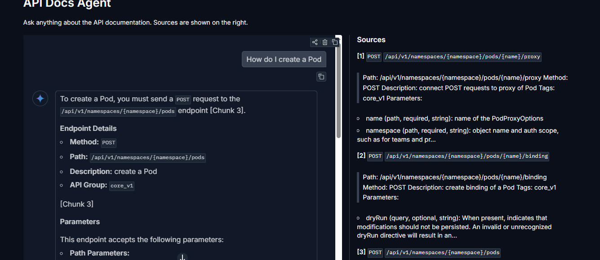
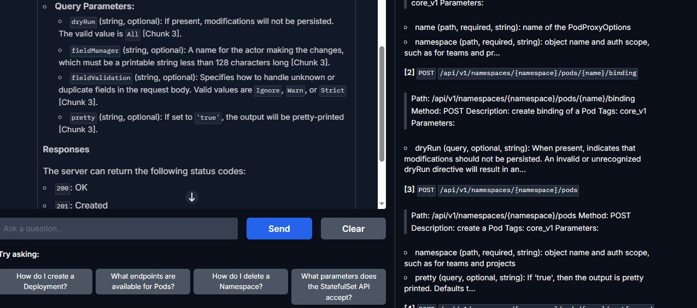
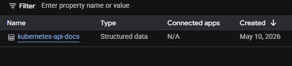

# api-rag

Finding a specific endpoint, parameter, or code example in API documentation usually means a lot of scrolling, searching, and tab-switching. This project is a chat interface that sits in front of your API docs — you ask a question in plain English and get a direct, sourced answer.

It works by searching your documentation first, then using that retrieved content to compose the answer. The response includes references to the source chunks so you can verify it or read further. It does not guess or generate information that isn't in your docs.

This workshop uses the **Kubernetes API** as the example, but the same pipeline works for any API with an OpenAPI spec or existing documentation.



*Chat on the left, retrieved source chunks on the right. Answers stream in real time.*



*Each source shows the HTTP method, endpoint path, and a snippet from the indexed documentation.*

## How it works

1. **Ingest** — Parses your API spec and chunks it into documents (one per endpoint, one per schema). Outputs a JSONL file.
2. **Index** — You upload the JSONL file to a Vertex AI Search data store.
3. **Query** — The Gradio web app takes a question, retrieves the top 5 matching chunks from Vertex AI Search, and passes them to Gemini to generate a structured answer with citations.

## Requirements

- Python 3.10+
- A Google Cloud project with these APIs enabled:
  - Vertex AI (`aiplatform.googleapis.com`)
  - Discovery Engine / Vertex AI Search (`discoveryengine.googleapis.com`)
- A Vertex AI Search data store (structured, **JSONL with document IDs**)
- Application Default Credentials configured (`gcloud auth application-default login`)

## Setup

Install `uv` if you don't have it:

```bash
curl -LsSf https://astral.sh/uv/install.sh | sh
```

Then install dependencies:

```bash
git clone <repo-url>
cd api-rag
uv pip install -r requirements.txt
```

## Step 1 — Ingest your API spec

Point the ingester at any OpenAPI spec — a URL or a local file, JSON or YAML, OpenAPI 2.0 or 3.0:

```bash
# From a URL
python -m src.ingest --spec https://example.com/openapi.json --name myapi

# From a local file
python -m src.ingest --spec ./openapi.yaml --name myapi
```

This writes `data/myapi_chunks.jsonl`. One chunk per endpoint operation, one per schema definition.

**Kubernetes example:**
```bash
python -m src.ingest \
  --spec https://raw.githubusercontent.com/kubernetes/kubernetes/v1.36.0/api/openapi-spec/swagger.json \
  --name kubernetes
```

## Step 2 — Upload to Vertex AI Search

1. Go to the [Vertex AI Search console](https://console.cloud.google.com/gen-app-builder/data-stores).
2. Create a new data store → **Structured Data** → **JSONL with document IDs**.
3. Import `data/<name>_chunks.jsonl` (upload via Cloud Storage or direct upload).
4. Wait for indexing to complete (a few minutes).
5. Note your **Data Store ID** — you'll need it in the next step.



## Step 3 — Run the app

Set the required environment variables:

```bash
export GCP_PROJECT_ID="your-project-id"
export VERTEX_SEARCH_DATA_STORE_ID="your-data-store-id"
export GCP_LOCATION="us-central1"   # optional, defaults to us-central1
export API_NAME="API Docs Agent"        # optional, used in the UI title
```

Then launch:

```bash
python src/app.py
```

This starts a Gradio web app. Open the printed URL in your browser.

## Using as an MCP server

Instead of the web app, you can run the same retrieval pipeline as an MCP server. This lets Claude (via Claude Code or Claude Desktop) call your API docs directly as a tool while writing code.

The server exposes two tools:
- `search_docs(query, num_results=5)` — search for endpoints, parameters, or usage details
- `get_schema(schema_name)` — look up a specific resource type by name

**Claude Code** — add to `.claude/settings.json` in your project:

```json
{
  "mcpServers": {
    "api-rag": {
      "command": "python",
      "args": ["-m", "src.mcp_server"],
      "env": {
        "GCP_PROJECT_ID": "your-project-id",
        "VERTEX_SEARCH_DATA_STORE_ID": "your-data-store-id",
        "GCP_LOCATION": "us-central1",
        "API_NAME": "API Docs Agent"
      }
    }
  }
}
```

**Claude Desktop** — add the same block under `mcpServers` in `claude_desktop_config.json`.

Once connected, Claude will automatically call `search_docs` when you ask questions about your API in the chat.

## Running in Google Colab

Open `notebooks/api_rag_colab.ipynb` in Colab. It walks through all three steps above and launches the app with a public share link.

## Environment variables

| Variable | Required | Default | Description |
|---|---|---|---|
| `GCP_PROJECT_ID` | Yes | — | Your Google Cloud project ID |
| `VERTEX_SEARCH_DATA_STORE_ID` | Yes | — | ID of your Vertex AI Search data store |
| `GCP_LOCATION` | No | `us-central1` | GCP region for Vertex AI |
| `API_NAME` | No | `API` | Display name shown in the UI title |
